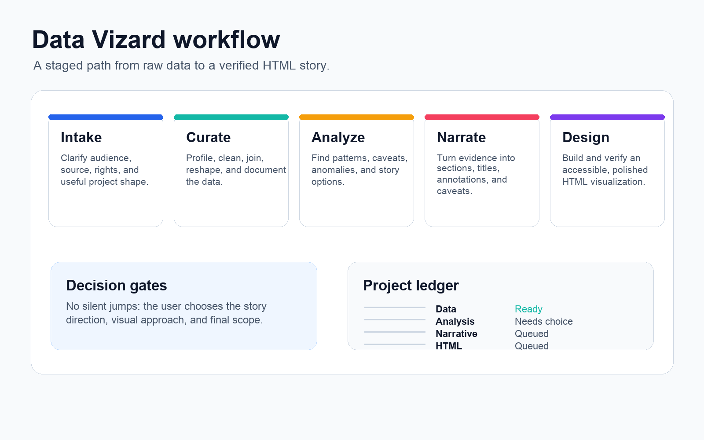
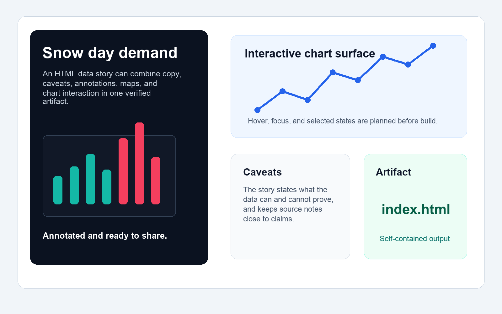

# Data Vizard Plugin

Data Vizard is an agent plugin for staged data visualization work. It bundles skills for dataset intake, curation, exploratory analysis, narrative framing, and HTML visualization design.



## What This Plugin Provides

- `data-vizard:data-vizard` - Orchestrates the full workflow and keeps user decision gates explicit.
- `data-vizard:data-curator` - Profiles, cleans, reshapes, joins, enriches, and documents datasets.
- `data-vizard:data-analyst` - Finds patterns, caveats, comparisons, anomalies, and evidence-backed story directions.
- `data-vizard:narrator` - Turns analysis into audience-facing structure, copy, titles, annotations, and caveats.
- `data-vizard:designer` - Designs and builds HTML visualization artifacts with chart, layout, accessibility, interaction, and motion guidance.

## Install From npm

Use the published installer:

```bash
npx data-vizard install
```

Equivalent commands:

```bash
pnpm dlx data-vizard install
bunx data-vizard install
```

The installer copies this plugin into `~/.data-vizard/marketplace`, writes Codex and Claude Code marketplace files, and attempts to install `data-vizard@data-vizard` with both CLIs when available.

## Compatibility

| Host | Status | Manifest | Notes |
| --- | --- | --- | --- |
| Codex app and CLI | Supported | `.codex-plugin/plugin.json` | Visual plugin metadata, skills, and local marketplace install are supported. Local/workspace plugins can appear through marketplaces or workspace sharing. |
| Claude Code | Supported | `.claude-plugin/plugin.json` | Uses a separate Claude manifest and marketplace file. Validate with `claude plugin validate`. |
| npm | Supported | `bin/data-vizard.js` | Ships the plugin, assets, marketplace files, root README, and changelog. |

## Development Install From A Fresh Clone

Normal installs should use npm. This clone-based path is only for development before a version is published.

Prerequisites:

- Codex app or Codex CLI with plugin support.
- Claude Code CLI with plugin support, if installing for Claude Code.
- This repository cloned locally.

From the repository root for Codex:

```bash
cd /path/to/data-vizard
codex plugin marketplace add "$(pwd)"
codex plugin add data-vizard@data-vizard
```

From the repository root for Claude Code:

```bash
cd /path/to/data-vizard
claude plugin marketplace add "$(pwd)"
claude plugin install data-vizard@data-vizard
```

Why this works:

- The Codex marketplace definition lives at `.agents/plugins/marketplace.json`.
- The Claude Code marketplace definition lives at `.claude-plugin/marketplace.json`.
- Both marketplaces are named `data-vizard`.
- Both point to the plugin source at `./plugins/data-vizard`.

Verify the install:

```bash
codex plugin marketplace list
codex plugin list --available --json
claude plugin list
```

After installing or reinstalling a plugin, start a new Codex thread or Claude Code session so the updated skills are loaded.

## Basic Usage

In a new Codex thread, invoke the orchestrator:

```text
Use $data-vizard:data-vizard to build a visualization from this CSV.
```

In Claude Code, invoke the orchestrator:

```text
/data-vizard:data-vizard Build a visualization from this CSV.
```

Or call a role skill directly when you already know the stage:

```text
Use $data-vizard:data-curator to profile and clean this dataset.
Use $data-vizard:data-analyst to find story directions in this curated CSV.
Use $data-vizard:narrator to turn this analysis into a story brief.
Use $data-vizard:designer to build the HTML visualization.
```

The orchestrator confirms where project artifacts should live in the active workspace before creating or changing files.



## Privacy And Data

Data Vizard works on files and datasets you provide in the active workspace. The plugin does not add a server, background sync, analytics, or external app connector. Codex and Claude Code host settings still control model access, file permissions, network access, and command approvals.

For sensitive datasets, review source rights before importing data, keep private raw files out of commits, and document caveats close to any public-facing claims.

## Updating After Pulling Changes

After pulling plugin updates:

```bash
cd /path/to/data-vizard
codex plugin add data-vizard@data-vizard
claude plugin install data-vizard@data-vizard
```

Then start a new Codex thread or Claude Code session. If Codex or Claude Code still shows an older version, confirm that the plugin manifests under `plugins/data-vizard/` have a new version, then reinstall again.

## Release Checks

Local package checks:

```bash
NPM_CONFIG_CACHE=/tmp/data-vizard-npm-cache npm pack --dry-run --json
node bin/data-vizard.js install --dry-run --root /tmp/data-vizard-local-smoke
```

Published-package smoke test:

```bash
cd /tmp
NPM_CONFIG_CACHE=/tmp/data-vizard-npm-cache npx --yes data-vizard@0.1.2 --version
NPM_CONFIG_CACHE=/tmp/data-vizard-npm-cache npx --yes data-vizard@0.1.2 install --dry-run --root /tmp/data-vizard-published-smoke
NPM_CONFIG_CACHE=/tmp/data-vizard-npm-cache npx --yes data-vizard@0.1.2 install --root /tmp/data-vizard-published-stage --no-codex --no-claude
```

Claude Code compatibility check:

```bash
claude plugin validate plugins/data-vizard
claude plugin marketplace add /tmp/data-vizard-published-stage
claude plugin install data-vizard@data-vizard --scope local
claude plugin list
```

## Troubleshooting

If Codex says:

```text
plugin `data-vizard` was not found in marketplace `data-vizard`
```

Register the repo marketplace first:

```bash
cd /path/to/data-vizard
codex plugin marketplace add "$(pwd)"
codex plugin add data-vizard@data-vizard
```

If `codex` itself fails because it cannot find a native vendor binary, repair the Codex CLI install:

```bash
npm uninstall -g @openai/codex
npm install -g @openai/codex@latest
codex --version
```

If optional plugin validation fails with `ModuleNotFoundError: No module named 'yaml'`, use a local validation environment rather than changing system Python:

```bash
python3 -m venv .venv-validator
.venv-validator/bin/python -m pip install --upgrade pip PyYAML
.venv-validator/bin/python /path/to/plugin-creator/scripts/validate_plugin.py plugins/data-vizard
```

That validation step is only for development checks; normal plugin installation does not require `PyYAML`.
